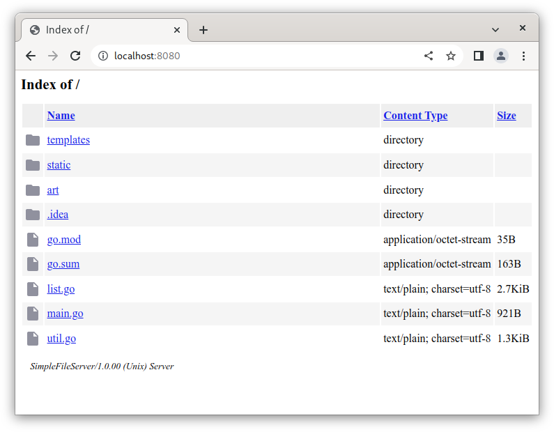

# simple-file-server
Extremely simple and lightweight Web file server with Web interface similar to Apache server



Build instructions
------------------

Requirements:

* Go 1.11+

Assuming you have it, type:

```
go build
```

This will produce `simple-file-server` executable in the project folder.

Usage
------------------

Run server with just two parameters:

```
./simple-file-server -port=<port, optional, 8080 is default> -dir=<directory to serve>
```

